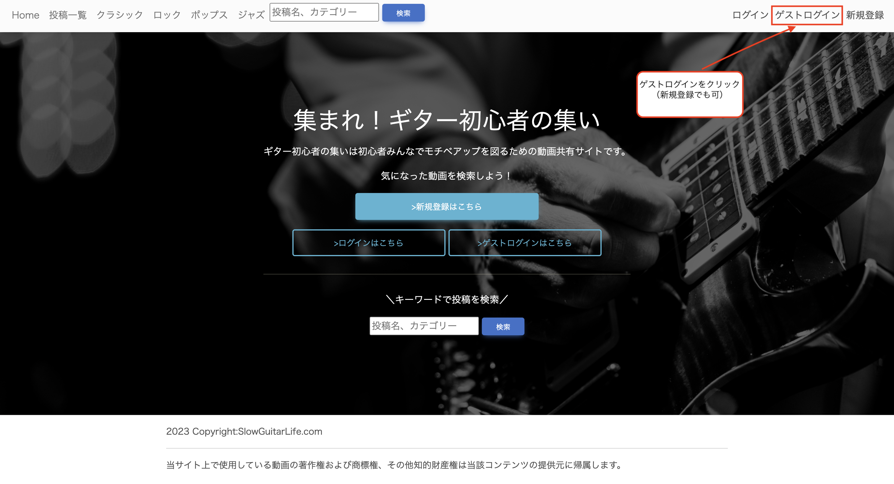
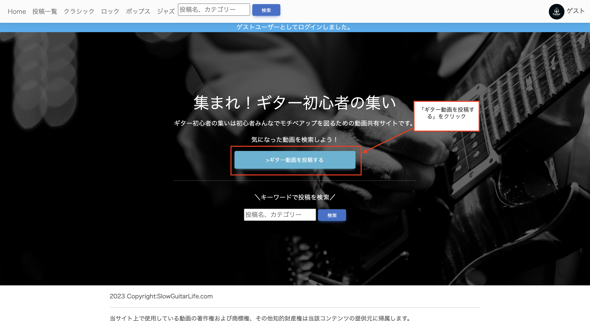
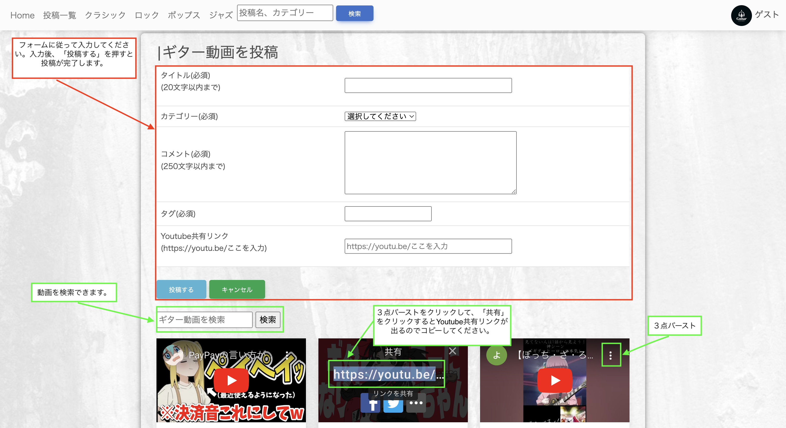
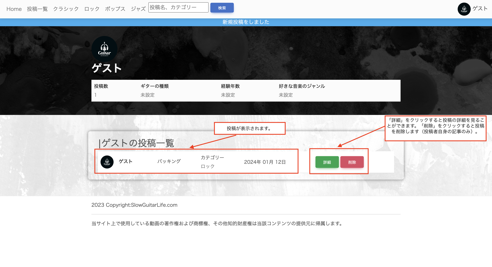
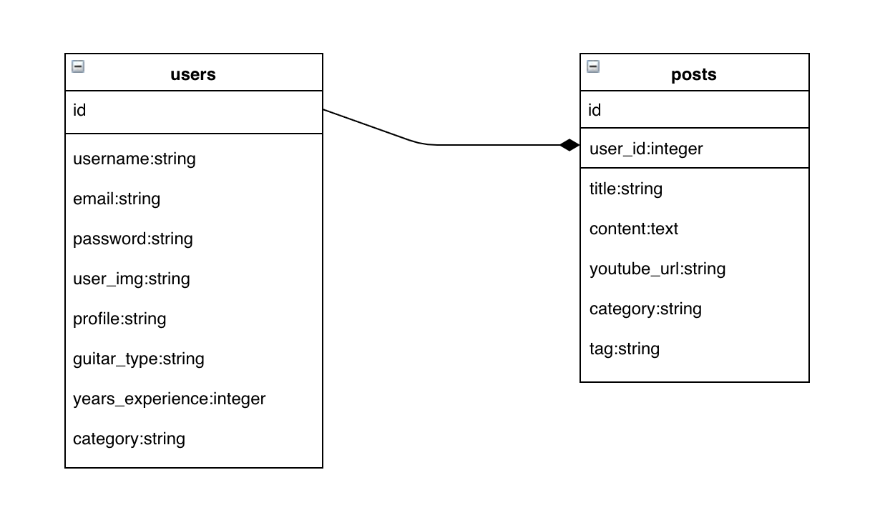

# サービスの概要
ギターを始めたけどお金を使いたくない人のモチベーション低下を防ぐための
動画共有型の投稿サイトです。

# サービスのURL
https://slow-guitar-life-1e95e25b613d.herokuapp.com

# サービスを開発した経緯
お金をなるべく使用したくない方は必然的に独学での練習になりますが、
独学だと演奏方法や弾いた音が正しいのかも分からず手探りの状態が続きます。

特に音楽のアニメやドラマの流行で楽器を購入する方が増加する一方、
なかなか上達しないフラストレーションから挫折してしまい、
同じ楽器が中古楽器店に並ぶ光景を見かけます。

現在、某ロックバンドアニメが流行っていますが今回も同じ光景を見ることを考えると
楽器経験者としては悲しいので今回このサービスを作成するに至りました。

# 機能の説明
ここではログインから新規投稿をするまでの流れを画像を用いてご説明いたします。

# 使用技術
bootstrapテンプレートMDB(CDN経由) 
Github 
SQLite3 
Ruby on Rails(バージョン6.1.7.6) 
Youtube Data API v3 
Devise 
rubocop 
RSpec 

# ER図

# こだわりポイント
投稿、編集画面にYoutube動画の検索フォームを実装した点です。

YouTubeサイトで直接動画のURLを取得するのはユーザーにとって
手間だと思いましたので、当サービスですぐ検索できるようにしました。

# 今後の展望
ChatGPTと連携して自分のレベルに応じた練習動画（もしくはその動画のURL）を
提示できるようにしたい。
